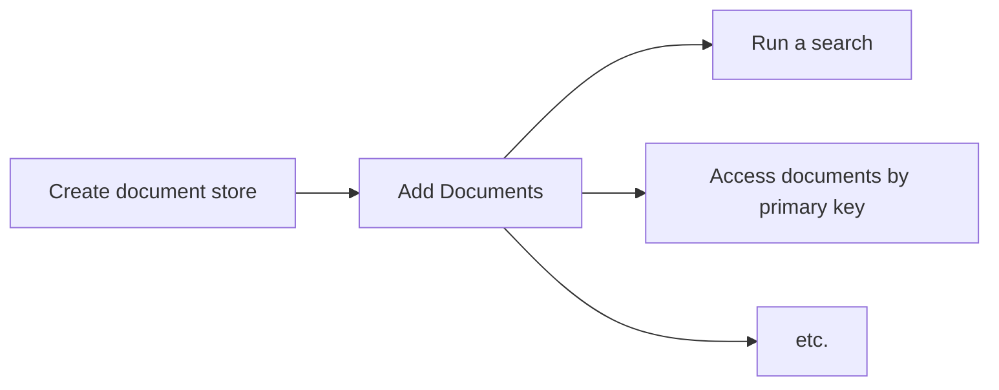

# Browser-search

### [**-> Take a look at the demo**](https://youldali.github.io/browser-search/)

Use this library to build a **full-featured search page on the browser**.
Compose **complex** queries and **store, filter, sort, paginate** your data directly on the browser without the need for a back-end / server queries.
This library had been written in **TypeScript**, and relies internally on **indexedDB** and **web-workers**

## Features
### Document store
- **Store** your data and have it available both online and **offline**. Relies internally on [IndexedDB](https://en.wikipedia.org/wiki/Indexed_Database_API), an in-browser document database
- **Access** any document by its primary key
- Get the **list of values** for a particular document field across all documents
### Search engine
- Compose **complex filters** to find a set of documents matching specific criteria. Supports both filters conjunctions (`&&`) and disjunctions (`||`).
- **Sort** your document by **ASC**ending or **DESC**ending order, on a specific field
- Supports **pagination**
- **Calculates** the number of documents that would match any non-applied filter + **indicates** the number of documents matched for each applied filters
- Supports **dynamic** filter configuration, changing during runtime
- All computations happen in a [web-worker](https://developer.mozilla.org/en-US/docs/Web/API/Web_Workers_API/Using_web_workers), keeping the **user interface responsive.**

## Use cases
- You want a search page up and running quickly without any back-end development involved
- You have a small set of public documents (up to a few thousands). Example: book library
- Your users have a fairly good hardware (since the filtering process will use the client ressources)
- Your users rely on the latest browser versions

### Caveats
- IndexedDB is not available (yet) on firefox incognito mode - which means the library can't be used
- Performances can vary according to the client's browser and hardware
## Table of contents
- [Features](#features)
  - [Document store](#document-store)
  - [Search engine](#search-engine)
- [Use cases](#use-cases)
  - [Caveats](#caveats)
- [Get Started](#get-started)
  - [Installation](#installation)
  - [Usage flow](#usage-flow)
  - [Step 1 - Create a store](#step-1---create-a-store)
  - [Step 2 - Add documents](#step-2---add-documents)
  - [Step 3 - run a search query / retrieve any specific documents by id](#step-3---run-a-search-query--retrieve-any-specific-documents-by-id)
- [API Methods](#api-methods)
  - [createStore](#createstore)
    - [Signature](#signature)
    - [Example](#example)
  - [addDocumentsToStore](#adddocumentstostore)
    - [Signature](#signature-1)
    - [Example](#example-1)
  - [searchStore](#searchstore)
    - [Algorithmic complexity](#algorithmic-complexity)
    - [Signature](#signature-2)
    - [Example](#example-2)
  - [getAllValuesOfProperty](#getallvaluesofproperty)
    - [Signature](#signature-3)
    - [Example](#example-3)
  - [getNumberOfDocumentsInStore](#getnumberofdocumentsinstore)
    - [Signature](#signature-4)
    - [Example](#example-4)
  - [getDocuments](#getdocuments)
    - [Signature](#signature-5)
    - [Example](#example-5)
  - [deleteStore](#deletestore)
    - [Signature](#signature-6)
    - [Example](#example-6)
  - [deleteStoreIfExist](#deletestoreifexist)
    - [Signature](#signature-7)
    - [Example](#example-7)
  - [deleteAllStores](#deleteallstores)
    - [Signature](#signature-8)
    - [Example](#example-8)
  - [doesStoreExist](#doesstoreexist)
    - [Signature](#signature-9)
    - [Example](#example-9)
- [API Interfaces](#api-interfaces)
  - [SimplifiedIndexConfig](#simplifiedindexconfig)
    - [Example](#example-10)
  - [Request](#request)
    - [Example](#example-11)
  - [FilterConfig](#filterconfig)
    - [Example](#example-12)
  - [Filter](#filter)
    - [Example](#example-13)
  - [Operator](#operator)
  - [SearchResponse](#searchresponse)
    - [Example](#example-14)
  - [NextFilterStateStat](#nextfilterstatestat)
## Get Started
### Installation
**Yarn**

    yarn add @browser-search/browser-search
**Npm**

    npm install -S @browser-search/browser-search

### Usage flow

### Step 1 - Create a store
Before anything, you need to create a store that will later hold your data.
You need to know in advance 
- the type of the documents you will store
- the fields that you will use for filtering / sorting. Those fields must be indexed.
See [createStore](#createStore) for usage

### Step 2 - Add documents
Before anything, you need to create a store that will later hold your data.
You need to know in advance the type of the documents you will store.
See [addDocumentsToStore](#addDocumentsToStore) for usage

### Step 3 - run a search query / retrieve any specific documents by id
You can now run complex queries to filter and sort your document, and display them to your users.
See [searchStore](#searchStore) for usage

You can also retrieve any specific document by the primary key (cf field defined as primary key at the store creation step)
See [getDocuments](#getDocuments) for usage

# API Methods
## createStore
Creates a new store
- identified with a unique name
- with the fields you want to index passed
- if the store already exists, it will be deleted

### Signature
```typescript
<T>(storeName: string) => (indexConfig: SimplifiedIndexConfig<T>) => (keyPath: keyof  T) =>  Promise<void>;
```

#### Generics
- `T` is the type of the document you will store

#### Parameters
- `storeName: string` is the unique name of the store
- `indexConfig: SimplifiedIndexConfig` is the list of the fields (the properties of the documents) you want to **index**. [See reference](#SimplifiedIndexConfig)
- `keyPath: keyof T`: is the **field / property name** which is to be considered the **primary key** of the store.

####  Return value
- A promise resolving when the store is created. May reject in case of failure. 

### Example
Let's say we want to store **books** of the following type:
```typescript
export  interface  Book {
	isbn: string; // primary key
	title: string;
	releaseDate: string;
	authors: string[];
	categories: Array<'fantasy' | 'sci-fi' | 'thriller'>;
	description: string;
}
```
We want to be able to filter and sort on every field but the description.
```typescript
import { SimplifiedIndexConfig, createStore } from '@browser-search/browser-search';

const storeName = "bookLibrary";
const indexConfig: SimplifiedIndexConfig<Book> = {
	simple: ['title', 'releaseDate'],
	array: ['authors', 'categories'] // every field which is an array
};
const keyPath = 'isbn';

const createStorePromise = createStore<Book>(storeId)(indexConfig)(keyPath);
createStorePromise
	.then(() => 
		console.log('Store successfully created !')
	);
	.catch(error =>
		console.error('The store could not be created', error);
	)
```

## addDocumentsToStore
Add documents to a store
- the documents must follow the same interface
- the documents must match the index created at the store creation. The indexed fields cannot be of type `object` / `boolean`
- if the store already exists, it will be deleted

### Signature
```typescript
<T>(storeName: string) =>  async (data: T[]): Promise<void>
```

#### Generics
- `T` is the type of the document to store. It should be the same type used in the `createStore` step.

#### Parameters
- `storeName: string`: is the name of the store to put the data into. The store must be created beforehand.
- `data: T[]` is the documents to store

####  Return value
- A promise resolving when the data is added to the store. May reject in case of failure. 

### Example
```typescript
import { addDocumentsToStore } from '@browser-search/browser-search';

const storeName = 'bookLibrary';
const books = [
	{
		isbn: '9780451524935',
		title: '1984',
		releaseDate: '1961-01-01',
		authors: ['George Orwell'],
		categories: ['sci-fi'];
		description: 'dystopian vision of a government...',
	}
]

const addDataToStorePromise = addDocumentsToStore(storeName)(books);
addDataToStorePromise
	.then(() => 
		console.log('Documents successfully added !')
	);
	.catch(error =>
		console.error('The documents could not be added', error);
	)
```

## searchStore

Retrieve a set of documents
- matching a set of filters
- sorted by a specific field
- paginated
- the fields you are sorting / filtering on **must be indexed**

### Algorithmic complexity
- Filtering your data: **O(kn)** where k = number of filters
- Sorting / paginating : **O(n)**
When the filters remain the same, any request skips the filtering step (it is cached)

### Signature
```typescript
<T, TFilterId  extends  string = string>(request: Request<T, TFilterId>): [Promise<SearchResponse<T, TFilterId>>, AbortSearch]
```

#### Generics
- `T` is the type of the documents stored
- `TFilterId` is the string union of all the filters ids defined in the filterConfiguration object, passed in the request. Defaults to a string.

#### Parameters
- `request: Request<T, TFilterId  extends  string = string>` is the object containing the search parameters. [See reference](#Request)

####  Return value

    [Promise<SearchResponse<T, TFilterId>>, AbortSearch]
- `AbortSearch: () =>  void`: is the function you can call to abort the search
 - `SearchResponse: SearchResponse<T, TFilterId  extends  string = string>` is an object containing the result of the request. [See reference](#SearchResponse)


### Example
Let's assume a store `bookLibrary` created with the following book interface
```typescript
export  interface  Book {
	isbn: string; // primary key
	title: string;
	price: number;
	releaseDate: string;
	authors: string[];
	categories: Array<'fantasy' | 'sci-fi' | 'thriller'>;
}
```
**Use case**: 
we want to be able to **filter** on the fields `price` in conjunction (`&&`) with the `category`:
- by `price`, and combine the filters with a disjunction (`||`): 
	- tiny price =< 5€   
	- small price =< 25€   
	- big price > 25€ 
- by `categories`, and combine the filters with a disjunction (`||`): 
	- category `fantasy`
	- category `sci-fi`
	- category `thriller`

We want to be able to `sort` by `releaseDate`.
We will display / **paginate with** 10 books per page.

**Scenario**: 
- a user wants to see the books with a **tiny price**,  of either the categories **fantasy** or **sci-fi**. 
- the user is on the first page
- the user wants to sort by **release date**, descending

```typescript
import { searchStore, FilterConfig, Request } from '@browser-search/browser-search';

type  FilterIds = 'tinyPrice' | 'smallPrice' | 'bigPrice' | 'categoryFantasy' | 'categorySciFi' | 'categoryThriller';

const filterConfig: FilterConfig<Book, FilterIds> = 
[
	// OR operator is used between each filter inside the same group (the array)
	[
		{ id:  'tinyPrice', field: 'price', operator: 'lte', operand:  5 },
		{ id:  'smallPrice', field: 'price', operator:  'inRangeOpenClosed', operand: [5, 25] },
		{ id:  'bigPrice', field: 'price', operator:  'gt', operand:  25 },
	],
	// AND operator is used between each group
	[
		{ id:  'categoryFantasy', field: 'categories', operator: 'contains', operand:  'fantasy' },
		{ id:  'categorySciFi', field: 'categories', operator: 'contains', operand: 'sci-fi' },
		{ id:  'categoryThriller', field: 'categories', operator: 'contains', operand:  'thriller' },
	],
];

const request: Request<Book, FilterId> = {
	storeId: bookLibrary,
	filterConfig,
	filtersApplied: ['tinyPrice', 'categoryFantasy', 'categorySciFi'], // the ids of the filter in the filter configuration that you are filtering on
	orderBy:  'releaseDate',
	orderDirection: 'DESC',
	perPage:  10,
	page:  0,
}
const [searchResponsePromise, abortSearch] = searchStore(request);

searchResponsePromise
	.then(searchResponse => {
		console.log(`Total number of document matching the filters: ${searchResponse.numberOfDocuments}`);
		
		console.log(`First 10 (cf perPage, page) documents matching the filters, sorted by release date DESC`, searchResponse.documents);

		console.log(`Statistic of each filter defined`, searchResponse.stats);
	})
	.catch(error => {
		console.error('An error occured during the search', error)
	})

```
## getAllValuesOfProperty
Retrieve the list of all the different values stored for a specific field.
This function can be useful if you don't know the list of values that a field can take, and you want to be dynamic filters on it
- the field **must be indexed**

### Signature
```typescript
<T  extends  IDBValidKey>(storeName: string) => (propertyName: string): Promise<T[]>
```

#### Generics
- `T` is the type of the property indexed, that should be compliant with the `IDBValidKey` interface, where `IDBValidKey = number | string | Date | BufferSource | IDBValidKey[]` 

#### Parameters
- `storeName: string` is the name of the store
- `propertyName: string` is the property for which you want to get all the values. It should be indexed at the store creation. [See SimplifiedIndexConfig reference]

####  Return value

    Promise<T[]>
   
### Example
Given a `book` interface having a `title: string`, and a `bookLibrary` store previously created with books.
To get the list of all the titles of the books stored:
```typescript
import { getAllValuesOfProperty } from '@browser-search/browser-search';

const allTitlesStoredPromise = getAllValuesOfProperty<string>('bookLibrary')('title');
allTitlesStoredPromise
	.then((allTitlesStored) => {
		console.log(allTitlesStored); // array of all the titles
	})
	.catch((error) => {
		console.log('An error occured when getting the list of titles', error); 
	})
```

## getNumberOfDocumentsInStore

returns the total number of documents stored

### Signature
```typescript
(storeName: string): Promise<number>
```
#### Parameters
- `storeName: string` is the name of the store

####  Return value

    Promise<number>
    
### Example
```typescript
import { getNumberOfDocumentsInStore } from '@browser-search/browser-search';

const numberOfDocumentsInStorePromise = getNumberOfDocumentsInStore('bookLibrary');

numberOfDocumentsInStorePromise
	.then((numberOfDocumentsInStore) => {
		console.log(numberOfDocumentsInStore); 
	})
	.catch((error) => {
		console.log('An error occured when getting the number of documents stored', error); 
	})
```

## getDocuments

retrieve a set of documents identified by its primary keys

### Signature
```typescript
<T>(storeName: string) => (documentIds: IDBValidKey[]): Promise<T[]>
```

#### Generics
- `T` is the type of the documents stored

#### Parameters
- `storeName: string` is the name of the store
- `documentIds: IDBValidKey[]` an array of primary keys. The primary key field is the one you specified at the store creation, using the `keyPath` parameter

####  Return value

    Promise<T[]>
    
### Example
Given a book library store, named `bookLibrary`, that stores books with the primary key field being `isbn: string`
```typescript
import { getDocuments } from '@browser-search/browser-search';

const documentsPromise = getDocuments(['978-3-16-148410-0', '978-3-17-148981-1', '978-3-16-148734-0']);

documentsPromise
	.then((documents) => {
		console.log(documents); // prints an array of the 3 books that match the isbn passed in parameter
	})
	.catch((error) => {
		console.log('An error occured when getting the documents', error); 
	})
```

## deleteStore

delete an existing store

### Signature
```typescript
(storeName: string): Promise<void>
```
#### Parameters
- `storeName: string` is the name of the store

####  Return value

    Promise<void>
    
### Example
```typescript
import { deleteStore } from '@browser-search/browser-search';

const deleteStorePromise = deleteStore('bookLibrary');

deleteStorePromise
	.then(() => {
		console.log('Store deleted successfully'); 
	})
	.catch((error) => {
		console.log('An error occured when deleting the store', error); 
	})
```

## deleteStoreIfExist

delete an existing store
- does not throw an error if the store does not exist

### Signature
```typescript
(storeName: string): Promise<void>
```
#### Parameters
- `storeName: string` is the name of the store

####  Return value

    Promise<void>
    
### Example
```typescript
import { deleteStoreIfExist } from '@browser-search/browser-search';

const deleteStorePromise = deleteStoreIfExist('bookLibrary');

deleteStorePromise
	.then(() => {
		console.log('Store deleted successfully'); 
	})
	.catch((error) => {
		console.log('An error occured when deleting the store', error); 
	})
```

## deleteAllStores

delete all stores created with the library [createStore](#createStore) function
- internally, it erases the database that contains all stores

### Signature
```typescript
(): Promise<void>
```

####  Return value

    Promise<void>
    
### Example
```typescript
import { deleteAllStores } from '@browser-search/browser-search';

const deleteAllStoresPromise = deleteAllStores();

deleteAllStoresPromise
	.then(() => {
		console.log('Stores deleted successfully'); 
	})
	.catch((error) => {
		console.log('An error occured when deleting the stores', error); 
	})
```

## doesStoreExist

returns `true` if the store exists, `false` otherwise

### Signature
```typescript
(storeName: string): Promise<boolean>
```
#### Parameters
- `storeName: string` is the name of the store

####  Return value

    Promise<void>
    
### Example
```typescript
import { doesStoreExist } from '@browser-search/browser-search';

const doesStoreExistPromise = doesStoreExist('bookLibrary');

doesStoreExistPromise
	.then((doesStoreExist) => {
		console.log(doesStoreExist); 
	})
```

# API Interfaces

## SimplifiedIndexConfig
used in [createStore](#createStore)

is the list of the fields (the properties of the documents) you want to **index**, with the primary key field omitted.

```typescript
interface SimplifiedIndexConfig: {
	simple?: Array<keyof  T>; // every field to index which is not an array
	array?: Array<keyof  T>; // every field to index which is an array
} 
``` 

The type of the property indexed must be compliant with the `IDBValidKey` interface, ie:
- `string`
- `number`
- `string[]`
- `number[]`
- `Date`

Types `object` / `boolean` are not supported. The property will **not be indexed**


If you plan to **filter** / **sort** on a property, then it needs to be included.
- If this property is an array, put it in the `array` property of the above mentioned schema. 
- If it's a plain property (string / number) then put it in the `simple` property 
- Properties of the `object` type are not supported there.
For more infos on the utility of this variable, refer to this [MDN docs on IndexedDB indexes](https://developer.mozilla.org/en-US/docs/Web/API/IDBObjectStore/createIndex)

### Example
```typescript
import  { SimplifiedIndexConfig }  from  '@browser-search/browser-search';

const indexConfig: SimplifiedIndexConfig<Book>  =  { 
	simple:  ['title',  'releaseDate'], 
	array:  ['authors', 'categories']  
};
``` 

## Request
used in [searchStore](#searchStore)

```typescript
interface  Request<T, TFilterId  extends  string = string> {
	storeId: string;
	filterConfig: FilterConfig<T, TFilterId>;
	filtersApplied: FiltersApplied<TFilterId>;
	orderBy?: string;
	orderDirection?: OrderDirection;
	page?: number;
	perPage?: number;
}
```
is the object containing the search parameters

**Generics**
- `T` is the type of the document stored
- `TFilterId` is the union of strings matching the id of each filter. Defaults to `string`

**with**
- `storeId: string`: the store name
- `filterConfig: FilterConfig<T, TFilterId>`: the filter configuration object describes all the different filters of your UI
- `filtersApplied: FilterId[]`: the list of the **ids** of the filters applied. The ids come from the `id` property in the filter definition of the `filterConfig`
- `orderBy?: keyof T = undefined:` (optional) the property name on which to sort the data (must be part of the indexConfig when creating the store)
- `orderDirection?: 'ASC' | 'DESC' = 'ASC'`: (optional) the direction in which sort the data (ascending / descending). 
- `page? = 0`: (optional) The search is paginated. So you will only receive the documents matching between [page * perPage, (page + 1) * perPage]
- `perPage?: number = 20`: (optional) the maximum number of documents returned

### Example

```typescript
import { FilterConfig, Request } from '@browser-search/browser-search';

type  FilterIds = 'categoryFantasy' | 'categorySciFi' | 'categoryThriller';

const filterConfig: FilterConfig<Book, FilterIds> = 
[
	[
		{ id:  'categoryFantasy', field: 'categories', operator: 'contains', operand:  'fantasy' },
		{ id:  'categorySciFi', field: 'categories', operator: 'contains', operand: 'sci-fi' },
		{ id:  'categoryThriller', field: 'categories', operator: 'contains', operand:  'thriller' },
	],
];

const request: Request<Book, FilterId> = {
	storeId: bookLibrary,
	filterConfig,
	filtersApplied: ['categoryFantasy', 'categorySciFi'], // the ids of the filter in the filter configuration that you are filtering on
	orderBy:  'releaseDate',
	orderDirection: 'DESC',
	perPage:  10,
	page:  0,
}
```

## FilterConfig
used in a [Request](#Request)

```typescript
type  FilterConfig<T, TFilterId  extends  string = string> = GroupOfFilters<T, TFilterId>[]
```
is the list of filters that your users can filter your documents on.

**Generics**
- `T` is the type of the document stored
- `TFilterId` is the union of strings matching the id of each filter. Defaults to `string`

**with**
```typescript
type GroupOfFilters<T, TFilterId  extends  string = string> = Filter<T, TFilterId>[]
```
Each filter inside a group will be treated as a disjunction (`||`), and each group as a conjunction with other groups.
For example:
 - given 3 filters, if we want the following filtering logic `(FilterA1 || FilterA2) && (FilterB)`
```typescript
// pseudo code
filterConfig = 
[
	[
		FilterA1, // OR operator between FilterA1 and FilterA2
		FilterA2,
	],
	// AND operator between each group, represented as an array
	[
		FilterB1
	]
	
]
```
-  given 6 filters, if we want the following filtering logic `(FilterA1 || FilterA2) && (FilterB) && (FilterC1 || FilterC2 || FilterC3)`
```typescript
// pseudo code
filterConfig = 
[
	[
		FilterA1, // OR operator between each filter inside the same group
		FilterA2,
	],
	// AND operator between each group
	[
		FilterB1
	],
	// AND operator between each group
	[
		FilterC1,// OR operator between each filter inside the same group
		FilterC2,
		FilterC3
	]
	
]
```

### Example

```typescript
import { FilterConfig, Request } from '@browser-search/browser-search';

type  FilterIds = 'categoryFantasy' | 'categorySciFi' | 'categoryThriller';

const filterConfig: FilterConfig<Book, FilterIds> = 
[
	[
		{ id:  'categoryFantasy', field: 'categories', operator: 'contains', operand:  'fantasy' },
		{ id:  'categorySciFi', field: 'categories', operator: 'contains', operand: 'sci-fi' },
		{ id:  'categoryThriller', field: 'categories', operator: 'contains', operand:  'thriller' },
	],
	[
		{ id: 'releaseCentury19', field: 'releaseDate', operator: 'inRangeCloseOpen', operand: ['1800-01-01', '1900-01-01']},
		{ id: 'releaseCentury20', field: 'releaseDate', operator: 'inRangeCloseOpen', operand: ['1900-01-01', '2000-01-01']},
		{ id: 'releaseCentury21Onward', field: 'releaseDate', operator: 'gte', operand: '2000-01-01'},
	],
	[
		{ id: 'tinyPrice', field: 'price', operator: 'lt', operand: 5},
	]
];


const releaseYear1990s: Filter<Book> = { id: 'releaseYear1990s', field: 'releaseDate', operator: 'inRangeCloseOpen', operand: ['1990-01-01', '2000-01-01']}
```

## Filter
used in a [FilterConfig](#FilterConfig)

```typescript
interface  Filter<T, TFilterId  extends  string = string> {
	id: TFilterId,
	field: keyof  T,
	operator: Operator,
	operand: FilterOperand,
};
```
is the description of a *filter* that the user can filter the documents on. 
A `Filter` instance describes 1 filtering operation, ie. a filter operating on **1 field**, using **1 operator** and **1 operand** such as
| | field | operator | operand |
|--|--|--|--|
|**Filter instance 1**| price | < | 20 |
|**Filter instance 2**| category | equals | 'fantasy' |


**Generics**
- `T` is the type of the document stored
- `TFilterId` is the union of strings matching the id of each filter. Defaults to `string`

**with**
- `id: TFilterId extends string`: the unique string that identifies the filter. Is then used in `SearchResponse.stats`. [See SearchResponse reference](#SearchResponse)
- `field: keyof  T`: the property of the document (of type `T`), that the filter will operate on. The property **value**, along with the **operator** and the **operand** are used to build the filtering operation. Example: `book.price < 20`
**The document property must be indexed at the store creation.** [See SimplifiedIndexConfig reference](#SimplifiedIndexConfig)
- `operator: Operator`: the operator used in the filtering operation. [See reference](#Operator)
- `operand: number | string | number[] | string[]`: the operand used in the filtering operation

### Example
```typescript
import { Filter } from  '@browser-search/browser-search';

const lowPriceFilter: Filter<Book> = { id: 'lowPrice', field: 'price', operator: 'lt', operand: 20 }
const midPriceFilter: Filter<Book> = { id: 'midPrice', field: 'price', operator: 'inRangeClosed', operand: [20, 100] }
const highPriceFilter: Filter<Book> = { id: 'highPrice', field: 'price', operator: 'gt', operand: 100 }

const categoryFilter: Filter<Book> = { id: 'categoryFantasy', field: 'category', operator: 'contains', operand: 'fantasy' }

const releaseYear1990s: Filter<Book> = { id: 'releaseYear1990s', field: 'releaseDate', operator: 'inRangeCloseOpen', operand: ['1990-01-01', '2000-01-01']}

```

## Operator
used in a [Filter](#Filter)
```
type  Operator = "lt" | "lte" | "gt" | "gte" | "equals" | "inRangeClosed" | "inRangeOpen" | "inRangeOpenClosed" | "inRangeClosedOpen" | "containsOptimized" | "contains"
```
- `lt` Less Than: `< x`
	- This filter requires **1** operand
	- Example: `book.price < 20`
- `lte` Less Than or Equal: `<= x`
	- This filter requires **1** operand
	- Example: `book.price <= 20`
- `gt` Greater Than: `> x`
	- This filter requires **1** operand
	-  Example: `book.price > 20`
- `gte` Greater Than or Equal: `>= x`
	- This filter requires **1** operand
	-  Example: `book.price >= 20`
- `equals` Equals: `=== x`
	- This filter requires **1** operand
	-  Example: `book.price === 20`
- `inRangeClosed`: `>= x && <= y`
	- This filter requires **2** operands expressed as an array: `[operand1, operand2]`
	-  Example: `book.price >= 20 && book.price <= 50`
- `inRangeOpen`: `> x && < y`
	- This filter requires **2** operands expressed as an array: `[operand1, operand2]`
	-  Example: `book.price > 20 && book.price < 50`
- `inRangeOpenClosed`: `> x && <= y`
	- This filter requires **2** operands expressed as an array: `[operand1, operand2]`
	-  Example:  `book.price > 20 && book.price <= 50`
- `inRangeClosedOpen`: `>= x && < y`
	- This filter requires **2** operands expressed as an array: `[operand1, operand2]`
	-  Example:  `book.price >= 20 && book.price < 50`
- `contains`: `includes(x)`
	- This filter requires **1** operand
	- **The document property must be an array**
	- The document property must be indexed using the `array` property of the `SimplifiedIndexConfig`, at the store creation. [See SimplifiedIndexConfig reference](#SimplifiedIndexConfig)
	-  Example:  `book.category.includes('fantasy')`

## SearchResponse
```typescript
interface SearchResponse<T, TFilterId  extends  string = string> {
	documents: T[],
	stats: Record<TFilterId, NextFilterStateStat>,
	numberOfDocuments: number,
}
```
is an object containing the result of a search.

**with**
 - `documents: T[]`: is the paginated documents matching the request
 
 - `stats: Record<TFilterId, NextFilterStateStat>` : is, for each filter, a statistic depending on its state (applied / not applied, part of a disjunction), with a `key = filterId` of each filter defined in the filter configuration, `value = NextFilterStateStat` . [See NextFilterStateStat reference](#NextFilterStateStat)
 
- `numberOfDocuments: number`: the **total** number of documents matching the filters. It is different from the number of documents returned in the `documents` property, which is paginated.

### Example
```typescript

console.log(searchResponse.documents);
/*
Prints:
[
	{ 
		isbn:  '9780451524935', 
		title: '1984, 
		price: 10,
		releaseDate:  '1961-01-01', 
		authors:  ['George Orwell'], 
		categories:  ['sci-fi']; 
		description:  'dystopian vision of a government...',  
	}
	,
	{...}
]
*/

console.log(searchResponse.stats);
// With filterApplied = ['categorySciFi'];
/*
Prints:
[
	'lowPrice': 
	{ 
		type: 'narrowed', // toggling on the filter will narrow the results to 5 documents
		nextNumberOfDocuments: 5 
	},
	'midPrice': 
	{ 
		type: 'narrowed', // toggling on the filter will narrow the results to 10 documents
		nextNumberOfDocuments: 10
	},
	'highPrice': 
	{ 
		type: 'narrowed', // toggling on the filter will narrow the results to 5 documents
		nextNumberOfDocuments: 5
	},
	'categorySciFi': 
	{ 
		type: 'matching', // filter is toggled on
		matchingNumberOfDocuments: 20 // number of documents matching the filter
	},
	'categoryFantasy': 
	{ 
		type: 'added',
		nextDocumentsAdded: 50 // same group, toggling the filter will add 50 documents
	},
	'categoryThriller': 
	{ 
		type: 'added',
		nextDocumentsAdded: 15 // same filtering group, toggling the filter will add 15 documents
	},
]
*/

console.log(searchResponse.numberOfDocuments);
/*
Prints: 20
*/

```

## NextFilterStateStat
```typescript
type  NextFilterStateStat = {
	type: 'added'; // For a non-applied filter with a disjunction rule (||)
	nextDocumentsAdded: number; // the number of documents added if the filter is selected
} |
{
	type: 'narrowed'; // For a non-applied filter with a conjunction rule (&&)
	nextNumberOfDocuments: number; // the number of documents if the filter is selected
} |
{
	type: 'matching'; // For an applied filter
	matchingNumberOfDocuments: number; // the number of documents matching the filter
}
```
is the object containing, for any filter defined in the filter configuration of the request:
- `type: 'matching`' when the filter is **applied**: the number of documents matching the filter
- If the filter is **not applied**: 
	- `type: 'added'` when the filter is part of a **disjunction group** with **at least 1 filter applied**: the number of documents that will be added by applying this filter on the current search
	-  `type: 'narrowed'` when the filter is part of a disjunction group **with no filter applied**, OR, the filter is **not part of a disjunction group**: the number of documents that will match when applying this filter to the current search
	
