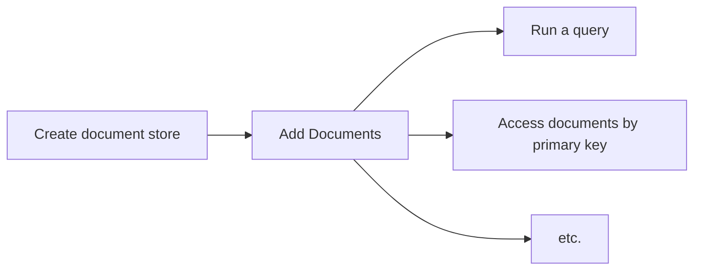

# Browser-search

### [**-> Take a look at the demo**](https://youldali.github.io/browser-search/)

Use this library to build a **full-featured search page on the browser**.
Compose **complex** queries and **store, filter, sort, paginate** your documents directly on the browser without the need for a back-end / server queries.
This library had been written in **TypeScript**, and relies internally on **indexedDB** and **web-workers**

## Features
### Document store
- **Store** your data and have it available both online and **offline**. Relies internally on [IndexedDB](https://en.wikipedia.org/wiki/Indexed_Database_API), an in-browser document database
- **Access** any document by its primary key
- Get the **list of values** for a particular field across all documents

### Search engine
- Compose **complex filters** to find a set of documents matching specific criteria. Supports both filters conjunctions (`&&`) and disjunctions (`||`).
- **Sort** your document by ascending or descending order, on a specific field
- Supports **pagination**
- **Calculates** the number of documents that would match any non-applied filters, and **indicates** the number of documents matched for each applied filter
- Supports **dynamic** filter configuration, changing during runtime
- All computations happen in a [web-worker](https://developer.mozilla.org/en-US/docs/Web/API/Web_Workers_API/Using_web_workers), keeping the **user interface responsive.**

## Use cases
- You want a search page up and running quickly without any back-end development involved
- You have a small set (up to a few thousands) of public documents; for example a book library
- Your users have a fairly good hardware (since the filtering process will use the client ressources)
- Your users rely on the recent browser versions (no IE support here). Both webworkers and indexedDB must be available.

### Caveats
- IndexedDB is not available (yet) on firefox incognito mode - which means the library can't be used in that mode for that browser
- Performances may vary according to the client's browser and hardware

## Table of contents
- [Features](#features)
- [Use cases](#use-cases)
- [Get Started](#get-started)
  - [Installation](#installation)
  - [Usage flow](#usage-flow)
- [API Methods](#api-methods)
	- [createStore](#createstore)
		- [Signature](#signature)
		- [Example](#example)
	- [addDocumentsToStore](#adddocumentstostore)
		- [Signature](#signature-1)
		- [Example](#example-1)
	- [queryStore](#querystore)
		- [Algorithmic complexity](#algorithmic-complexity)
		- [Signature](#signature-2)
		- [Example](#example-2)
	- [getIndexValues](#getindexvalues)
		- [Signature](#signature-3)
		- [Example](#example-3)
	- [getNumberOfDocumentsInStore](#getnumberofdocumentsinstore)
		- [Signature](#signature-4)
		- [Example](#example-4)
	- [getDocuments](#getdocuments)
		- [Signature](#signature-5)
		- [Example](#example-5)
	- [deleteStore](#deletestore)
		- [Signature](#signature-6)
		- [Example](#example-6)
	- [deleteStoreIfExist](#deletestoreifexist)
		- [Signature](#signature-7)
		- [Example](#example-7)
	- [deleteAllStores](#deleteallstores)
		- [Signature](#signature-8)
		- [Example](#example-8)
	- [doesStoreExist](#doesstoreexist)
		- [Signature](#signature-9)
		- [Example](#example-9)
- [API Interfaces](#api-interfaces)
	- [SimplifiedIndexConfig](#simplifiedindexconfig)
		- [Example](#example-10)
	- [QueryRequest](#queryrequest)
		- [Example](#example-11)
	- [FilterConfig](#filterconfig)
		- [Example](#example-12)
	- [Filter](#filter)
		- [Example](#example-13)
	- [Operator](#operator)
	- [QueryResponse](#queryresponse)
		- [Example](#example-14)
	- [NextFilterStateStat](#nextfilterstatestat)

## Get Started
### Installation
**Yarn**

    yarn add @browser-search/browser-search
**Npm**

    npm install -S @browser-search/browser-search

### Usage flow

### Step 1 - Create a store
Before anything, you need to create a store that will later hold your data.
You need to know in advance 
- the type of the documents you will store
- the fields that you will use for filtering / sorting. Those fields must be indexed. No indexed field can be of type `object` / `boolean`. cf `IDBValidKey` typescript interface.
See [createStore](#createStore) for usage

### Step 2 - Add documents
Then you can add documents to the newly created store. Those documents must match the fields defined at the store creation step.
See [addDocumentsToStore](#addDocumentsToStore) for usage

### Step 3 - run a search query / retrieve any specific documents by id
You can now run complex queries to filter and sort your document, and display them to your users.
See [queryStore](#queryStore) for usage

You can also retrieve any specific document by the primary key (cf field defined as primary key at the store creation step)
See [getDocuments](#getDocuments) for usage

# API Methods
## createStore
Creates a new store
- identified with a unique name
- with the fields you want to index
- if the store already exists, it will be deleted

### Signature
```typescript
<TDocument>({
	storeId,
	indexConfig,
	keyPath
}: CreateStoreRequest<TDocument>): Promise<void>
```

#### Generics
- `TDocument` is the type of the documents you will store

#### Parameters
- `request: CreateStoreRequest<TDocument>` 
	- `storeId: string` is the unique name of the store to create
	- `indexConfig: SimplifiedIndexConfig` is the list of the fields (the properties of the documents) you want to **index**. [See reference](#SimplifiedIndexConfig)
	- `keyPath: keyof T`: is the **field / property name** which is to be considered the **primary key** of the store.

####  Return value
- A promise resolving when the store is created. May reject in case of failure. 

### Example
Let's say we want to store **books** of the following type:
```typescript
export  interface  Book {
	isbn: string; // primary key
	title: string;
	releaseDate: string;
	authors: string[];
	categories: Array<'fantasy' | 'sci-fi' | 'thriller'>;
	description: string;
}
```
We want to be able to filter and sort on every field but the description.
```typescript
import { SimplifiedIndexConfig, createStore } from '@browser-search/browser-search';

const storeId = "bookLibrary";
const indexConfig: SimplifiedIndexConfig<Book> = {
	simple: ['title', 'releaseDate'], // every plain field (not array) to index
	array: ['authors', 'categories'] // every field in Book which is an array, and that we want to index
};
const keyPath = 'isbn';

const createStorePromise = createStore<Book>({
  storeId,
  indexConfig,
  keyPath,
});
createStorePromise
	.then(() => 
		console.log('Store successfully created !')
	);
	.catch(error =>
		console.error('The store could not be created', error);
	)
```

## addDocumentsToStore
Add documents to a store
- the documents must have the same type
- the documents must match the indexes created at the store creation.

### Signature
```typescript
<TDocument>({
  storeId,
  documents,
}: AddDocumentsToStoreRequest<TDocument>): Promise<void>
```

#### Generics
- `TDocument` is the type of the documents to store. It should be the same type used in the `createStore` step.

#### Parameters
-  `request: AddDocumentsToStoreRequest<TDocument>`
	- `storeId: string`: is the name of the store to put the data into. The store must be created beforehand.
	- `documents: TDocument[]` is the documents to store

####  Return value
- A promise resolving when the data is added to the store. May reject in case of failure. 

### Example
```typescript
import { addDocumentsToStore } from '@browser-search/browser-search';

const storeId = 'bookLibrary';
const books = [
	{
		isbn: '9780451524935',
		title: '1984',
		releaseDate: '1961-01-01',
		authors: ['George Orwell'],
		categories: ['sci-fi'];
		description: 'dystopian vision of a government...',
	}
]

const addDataToStorePromise = addDocumentsToStore({
  storeId,
  documents: books
});
addDataToStorePromise
	.then(() => 
		console.log('Documents successfully added !')
	);
	.catch(error =>
		console.error('The documents could not be added', error);
	)
```

## queryStore

Retrieve a set of documents
- matching a set of filters
- sorted by a specific field
- paginated
- the fields you are sorting / filtering on **must be indexed**, cf. [createStore](#createStore)

### Algorithmic complexity
- Filtering + sorting + paginating your data: **O(kn)** where k = number of filters
- Only Sorting + paginating : **O(n)**
When the filters remain the same, any new request skips the filtering step (it is cached).

### Signature
```typescript
<TDocument, TFilterId  extends  string = string>(request: QueryRequest<TDocument, TFilterId>): [Promise<QueryResponse<TDocument, TFilterId>>, AbortSearch]
```

#### Generics
- `TDocument` is the type of the documents stored
- `TFilterId` is the string union of all the filters ids defined in the filterConfiguration object, passed in the request. Defaults to a string.

#### Parameters
- `request: QueryRequest<TDocument, TFilterId  extends  string = string>` is the object containing the search parameters. [See reference](#QueryRequest)

####  Return value

    [Promise<SearchResponse<T, TFilterId>>, AbortSearch]
 - `queryResponse: QueryResponse<TDocument, TFilterId  extends  string = string>` is an object containing the result of the request. [See reference](#QueryResponse)
 - `abortSearch: () =>  void`: is the function you can call to abort the search


### Example
Let's assume a store `bookLibrary` created with the following book interface
```typescript
export  interface  Book {
	isbn: string; // primary key
	title: string;
	price: number;
	releaseDate: string;
	authors: string[];
	categories: Array<'fantasy' | 'sci-fi' | 'thriller'>;
}
```
**Use case**: 
we want to be able to **filter** on the fields `price` in conjunction (`&&`) with the `category`:
- by `price`, and combine the filters with a disjunction (`||`): 
	- tiny price =< 5€   
	- small price =< 25€   
	- big price > 25€ 
- by `categories`, and combine the filters with a disjunction (`||`): 
	- category `fantasy`
	- category `sci-fi`
	- category `thriller`
Example: all books **<= 5€** *AND* that belong to the categories **fantasy** *OR* **sci-fi**

We want to be able to `sort` by `releaseDate`.
We will display / **paginate with** 10 books per page.

**Scenario**: 
- a user wants to see the books with a **tiny price**,  of either the categories **fantasy** or **sci-fi**. 
- the user is on the first page
- the user wants to sort by **release date**, descending

```typescript
import { queryStore, FilterConfig, QueryRequest } from '@browser-search/browser-search';

type  FilterIds = 'tinyPrice' | 'smallPrice' | 'bigPrice' | 'categoryFantasy' | 'categorySciFi' | 'categoryThriller';

const filterConfig: FilterConfig<Book, FilterIds> = 
[
	// OR operator is used between each filter inside the same group (ie. the same inner array)
	[
		{ id:  'tinyPrice', field: 'price', operator: 'lte', operand:  5 },
		{ id:  'smallPrice', field: 'price', operator:  'inRangeOpenClosed', operand: [5, 25] },
		{ id:  'bigPrice', field: 'price', operator:  'gt', operand:  25 },
	],
	// AND operator is used between each group (ie. between arrays)
	[
		{ id:  'categoryFantasy', field: 'categories', operator: 'contains', operand:  'fantasy' },
		{ id:  'categorySciFi', field: 'categories', operator: 'contains', operand: 'sci-fi' },
		{ id:  'categoryThriller', field: 'categories', operator: 'contains', operand:  'thriller' },
	],
];

const request: QueryRequest<Book, FilterId> = {
	storeId: 'bookLibrary',
	filterConfig,
	filtersApplied: ['tinyPrice', 'categoryFantasy', 'categorySciFi'], // the ids of the filter in the filter configuration that you are filtering on
	orderBy:  'releaseDate',
	orderDirection: 'DESC',
	perPage:  10,
	page:  0,
}
const [queryResponsePromise, abortSearch] = queryStore(request);

queryResponsePromise
	.then(queryResponse => {
		console.log(`Total number of documents matching the filters: ${queryResponse.numberOfDocuments}`);
		
		console.log(`First 10 (cf perPage, page) documents matching the filters, sorted by release date DESC`, queryResponse.documents);

		console.log(`Statistic of each filter defined`, queryResponse.stats);
	})
	.catch(error => {
		console.error('An error occured during the search', error)
	})

```
## getIndexValues
Retrieve the list of all the different values stored for a specific field, across all documents.
This function can be useful if you don't know the list of values that a field can take. For example if you want to build dynamic filters on it
- the field **must be indexed**

### Signature
```typescript
<T extends IDBValidKey>({
  storeId,
  field,
}: GetIndexValuesRequest): Promise<T[]>
```

#### Generics
- `T` is the type of the property indexed, that should be compliant with the `IDBValidKey` interface, where `IDBValidKey = number | string | Date | BufferSource | IDBValidKey[]` 

#### Parameters
-  `request: GetIndexValuesRequest`
	- `storeId: string` is the name of the store
	- `field: string` is the field / property for which you want to get all the values. It should be indexed at the store creation. [See createStore reference](#createStore)

####  Return value

    Promise<T[]>
   
### Example
Given a `book` interface containing a `title: string` property, and a `bookLibrary` store previously created with books.
To get the list of all the titles of the books stored:
```typescript
import { getIndexValues } from '@browser-search/browser-search';

const allTitlesStoredPromise = getIndexValues<string>({
  storeId: 'bookLibrary',
  field: 'title',
});
allTitlesStoredPromise
	.then((allTitlesStored) => {
		console.log(allTitlesStored); // array of all the titles
	})
	.catch((error) => {
		console.log('An error occured when getting the list of titles', error); 
	})
```

## getNumberOfDocumentsInStore

returns the total number of documents stored

### Signature
```typescript
({
  storeId,
}: GetNumberOfDocumentsInStoreRequest): Promise<number>
```
#### Parameters
- `request: GetNumberOfDocumentsInStoreRequest`
	- `storeName: string` is the name of the store

####  Return value

    Promise<number>
    
### Example
```typescript
import { getNumberOfDocumentsInStore } from '@browser-search/browser-search';

const numberOfDocumentsInStorePromise = getNumberOfDocumentsInStore({storeId: 'bookLibrary'});

numberOfDocumentsInStorePromise
	.then((numberOfDocumentsInStore) => {
		console.log(numberOfDocumentsInStore); 
	})
	.catch((error) => {
		console.log('An error occured when getting the number of documents stored', error); 
	})
```

## getDocuments

retrieve a set of documents identified by its primary keys

### Signature
```typescript
<TDocument>({
  storeId,
  documentIds,
}: GetDocumentsRequest): Promise<TDocument[]>
```

#### Generics
- `TDocument` is the type of the documents stored

#### Parameters
- `request: GetDocumentsRequest`
	- `storeId: string` is the name of the store
	- `documentIds: IDBValidKey[]` an array of primary keys. The primary key field is the one you specified at the store creation, using the `keyPath` parameter

####  Return value

    Promise<T[]>
    
### Example
Given a book library store, named `bookLibrary`, that stores books with the primary key field being `isbn: string`
```typescript
import { getDocuments } from '@browser-search/browser-search';

const documentsPromise = getDocuments({
  storeId: 'bookLibrary',
  documentIds: ['978-3-16-148410-0', '978-3-17-148981-1', '978-3-16-148734-0'], // array of isbn values
});

documentsPromise
	.then((documents) => {
		console.log(documents); // prints an array of the 3 books that match the isbn passed in parameter
	})
	.catch((error) => {
		console.log('An error occured when getting the documents', error); 
	})
```

## deleteStore

delete an existing store

### Signature
```typescript
({
  storeId
}: DeleteStoreRequest): Promise<void>
```
#### Parameters
- `request: DeleteStoreRequest`
	- `storeId: string` is the name of the store

####  Return value

    Promise<void>
    
### Example
```typescript
import { deleteStore } from '@browser-search/browser-search';

const deleteStorePromise = deleteStore({storeId: 'bookLibrary'});

deleteStorePromise
	.then(() => {
		console.log('Store deleted successfully'); 
	})
	.catch((error) => {
		console.log('An error occured when deleting the store', error); 
	})
```

## deleteStoreIfExist

delete an existing store
- does not throw an error if the store does not exist

### Signature
```typescript. 
({
  storeId,
}: DeleteStoreIfExistRequest): Promise<void>
```
#### Parameters
- `request: DeleteStoreRequest`
	- `storeId: string` is the name of the store

####  Return value

    Promise<void>
    
### Example
```typescript
import { deleteStoreIfExist } from '@browser-search/browser-search';

const deleteStorePromise = deleteStoreIfExist({storeId: 'bookLibrary'});

deleteStorePromise
	.then(() => {
		console.log('Store deleted successfully'); 
	})
	.catch((error) => {
		console.log('An error occured when deleting the store', error); 
	})
```

## deleteAllStores

delete all stores created with the library [createStore](#createStore) function
- internally, it erases the database that contains all stores

### Signature
```typescript
(): Promise<void>
```

####  Return value

    Promise<void>
    
### Example
```typescript
import { deleteAllStores } from '@browser-search/browser-search';

const deleteAllStoresPromise = deleteAllStores();

deleteAllStoresPromise
	.then(() => {
		console.log('Stores deleted successfully'); 
	})
	.catch((error) => {
		console.log('An error occured when deleting the stores', error); 
	})
```

## doesStoreExist

returns `true` if the store exists, `false` otherwise

### Signature
```typescript
({
  storeId,
}: DoesStoreExistRequest): Promise<boolean>
```
#### Parameters
- `request: DoesStoreExistRequest`
	- `storeId: string` is the name of the store

####  Return value

    Promise<boolean>
    
### Example
```typescript
import { doesStoreExist } from '@browser-search/browser-search';

const doesStoreExistPromise = doesStoreExist({storeId: 'bookLibrary'});

doesStoreExistPromise
	.then((doesStoreExist) => {
		console.log(doesStoreExist); 
	})
```

# API Interfaces

## SimplifiedIndexConfig
used in [createStore](#createStore)

is the list of the fields (ie. the properties of the documents) you want to **index**, with the primary key field omitted.

```typescript
interface SimplifiedIndexConfig: {
	simple?: Array<keyof  T>; // every field to index which is not an array
	array?: Array<keyof  T>; // every field to index which is an array
} 
``` 

The type of the property indexed must be compliant with the `IDBValidKey` interface, ie:
- `string`
- `number`
- `string[]`
- `number[]`
- `Date`

Types `object` / `boolean` are not supported. The property will **not be indexed**


If you plan to **filter** / **sort** on a property, then it needs to be included.
- If this property is an array, put it in the `array` property of the above mentioned schema. 
- If it's a plain property (`string` / `number`) then put it in the `simple` property 
- Properties of the `object` type are not supported there.
For more infos on the utility of this variable, refer to this [MDN docs on IndexedDB indexes](https://developer.mozilla.org/en-US/docs/Web/API/IDBObjectStore/createIndex)

### Example
```typescript
import  { SimplifiedIndexConfig }  from  '@browser-search/browser-search';

const indexConfig: SimplifiedIndexConfig<Book>  =  { 
	simple:  ['title',  'releaseDate'], 
	array:  ['authors', 'categories']  
};
``` 

## QueryRequest
used in [queryStore](#queryStore)
describes a request to query a store

```typescript
interface  QueryRequest<TDocument, TFilterId  extends  string = string> {
	storeId: string;
	filterConfig: FilterConfig<T, TFilterId>;
	filtersApplied: FiltersApplied<TFilterId>;
	orderBy?: string;
	orderDirection?: OrderDirection;
	page?: number;
	perPage?: number;
}
```
is the object containing the search parameters

**Generics**
- `TDocument` is the type of the documents stored
- `TFilterId` is the union of strings matching the id of each filter. Defaults to `string`. Optional

**with**
- `storeId: string`: the store name
- `filterConfig: FilterConfig<T, TFilterId>`: the filter configuration object describes all the different filters of your UI. See [FilterConfig](#FilterConfig)
- `filtersApplied: FiltersApplied<TFilterId>`: the list of the **ids** (`id` property) of the filters  applied.
`type FiltersApplied = TFilterId[]` The ids come from the `id` property in the filter definition of the `filterConfig`
- `orderBy?: keyof TDocument = undefined:` (optional) the property name on which to sort the data (must be part of the indexConfig when creating the store)
- `orderDirection?: 'ASC' | 'DESC' = 'ASC'`: (optional) the direction in which sort the data (ascending / descending). 
- `page?: number = 0`: (optional) The query response is paginated. So you will only receive the documents ranging between [page * perPage, (page + 1) * perPage]
- `perPage?: number = 20`: (optional) the maximum number of documents returned per page

### Example

```typescript
import { FilterConfig, QueryRequest } from '@browser-search/browser-search';

type  FilterIds = 'categoryFantasy' | 'categorySciFi' | 'categoryThriller';

const filterConfig: FilterConfig<Book, FilterIds> = 
[
	[
		{ id:  'categoryFantasy', field: 'categories', operator: 'contains', operand:  'fantasy' },
		{ id:  'categorySciFi', field: 'categories', operator: 'contains', operand: 'sci-fi' },
		{ id:  'categoryThriller', field: 'categories', operator: 'contains', operand:  'thriller' },
	],
];

const request: QueryRequest<Book, FilterId> = {
	storeId: 'bookLibrary',
	filterConfig,
	filtersApplied: ['categoryFantasy', 'categorySciFi'], // the ids of the filters (coming from the filter configuration) that you are filtering on
	orderBy:  'releaseDate',
	orderDirection: 'DESC',
	perPage:  10,
	page:  0,
}
```

## FilterConfig
used in a [QueryRequest](#QueryRequest)
is the list of filters that you want **to be able** to filter your documents on.

```typescript
type  FilterConfig<TDocument, TFilterId  extends  string = string> = GroupOfFilters<TDocument, TFilterId>[]
```


**Generics**
- `TDocument` is the type of the document stored
- `TFilterId` is the union of strings matching the id of each filter. Defaults to `string`

**with**
```typescript
type GroupOfFilters<TDocument, TFilterId  extends  string = string> = Filter<TDocument, TFilterId>[]
```
A group of filters is merely an array of [Filter](#Filter).
Each filter inside a group will be treated as a disjunction (`||`) when the filters are applied, and each group as a conjunction (`&&`) with other groups.

**For example**
 - given 3 filters, if we want the following filtering logic `(FilterA1 || FilterA2) && (FilterB)`
```typescript
// pseudo code
filterConfig = 
[
	[
		FilterA1, // OR operator between FilterA1 and FilterA2
		FilterA2,
	],
	// AND operator between each group, represented as an array
	[
		FilterB1
	]
	
]
```
-  given 6 filters, if we want the following filtering logic `(FilterA1 || FilterA2) && (FilterB) && (FilterC1 || FilterC2 || FilterC3)`
```typescript
// pseudo code
filterConfig = 
[
	[
		FilterA1, // OR operator between each filter inside the same group
		FilterA2,
	],
	// AND operator between each group
	[
		FilterB1
	],
	// AND operator between each group
	[
		FilterC1,// OR operator between each filter inside the same group
		FilterC2,
		FilterC3
	]
	
]
```

### Example

```typescript
import { FilterConfig } from '@browser-search/browser-search';

type  FilterIds = 'categoryFantasy' | 'categorySciFi' | 'categoryThriller';

const filterConfig: FilterConfig<Book, FilterIds> = 
[
	[
		{ id:  'categoryFantasy', field: 'categories', operator: 'contains', operand:  'fantasy' },
		{ id:  'categorySciFi', field: 'categories', operator: 'contains', operand: 'sci-fi' },
		{ id:  'categoryThriller', field: 'categories', operator: 'contains', operand:  'thriller' },
	],
	[
		{ id: 'releaseCentury19', field: 'releaseDate', operator: 'inRangeCloseOpen', operand: ['1800-01-01', '1900-01-01']},
		{ id: 'releaseCentury20', field: 'releaseDate', operator: 'inRangeCloseOpen', operand: ['1900-01-01', '2000-01-01']},
		{ id: 'releaseCentury21Onward', field: 'releaseDate', operator: 'gte', operand: '2000-01-01'},
	],
	[
		{ id: 'tinyPrice', field: 'price', operator: 'lt', operand: 5},
	]
];

```

## Filter
used in a [FilterConfig](#FilterConfig)
is the description of a *filter* that the user can use to filter the documents on. 

```typescript
interface  Filter<TDocument, TFilterId  extends  string = string> {
	id: TFilterId,
	field: keyof  TDocument,
	operator: Operator,
	operand: FilterOperand,
};
```

A `Filter` instance describes 1 filtering operation, ie. a filter operating on **1 field**, using **1 operator** and **1 operand** such as
| | field | operator | operand |
|--|--|--|--|
|**Filter instance 1**| price | < | 20 |
|**Filter instance 2**| category | equals | 'fantasy' |


**Generics**
- `TDocument` is the type of the document stored
- `TFilterId` is the union of strings matching the id of each filter. Defaults to `string`

**with**
- `id: TFilterId extends string`: the unique string that identifies the filter. Is then used in `QueryResponse.stats`. [See QueryResponse reference](#QueryResponse)
The `id` is also referenced in the `filterApplied` property of [QueryRequest](#QueryRequest), when you want to actually apply the filter
- `field: keyof TDocument`: the field of the document that the filter will operate on. The properties **value**, along with the **operator** and the **operand** are used to build the filtering operation. Example: `book.price < 20`
**The document field must be indexed at the store creation.** [See SimplifiedIndexConfig reference](#SimplifiedIndexConfig)
- `operator: Operator`: the operator used in the filtering operation. [See reference](#Operator)
- `operand: number | string | number[] | string[]`: the operand used in the filtering operation

### Example
```typescript
import { Filter } from  '@browser-search/browser-search';

const lowPriceFilter: Filter<Book> = { id: 'lowPrice', field: 'price', operator: 'lt', operand: 20 }
const midPriceFilter: Filter<Book> = { id: 'midPrice', field: 'price', operator: 'inRangeClosed', operand: [20, 100] }
const highPriceFilter: Filter<Book> = { id: 'highPrice', field: 'price', operator: 'gt', operand: 100 }

const categoryFantasyFilter: Filter<Book> = { id: 'categoryFantasy', field: 'category', operator: 'contains', operand: 'fantasy' }

const releaseYear1990s: Filter<Book> = { id: 'releaseYear1990s', field: 'releaseDate', operator: 'inRangeCloseOpen', operand: ['1990-01-01', '2000-01-01']}

```

## Operator
used in a [Filter](#Filter)
```
type  Operator = "lt" | "lte" | "gt" | "gte" | "equals" | "inRangeClosed" | "inRangeOpen" | "inRangeOpenClosed" | "inRangeClosedOpen" | "contains"
```
- `lt` Less Than: `< x`
	- This filter requires **1** operand
	- Example: `book.price < 20`
- `lte` Less Than or Equal: `<= x`
	- This filter requires **1** operand
	- Example: `book.price <= 20`
- `gt` Greater Than: `> x`
	- This filter requires **1** operand
	-  Example: `book.price > 20`
- `gte` Greater Than or Equal: `>= x`
	- This filter requires **1** operand
	-  Example: `book.price >= 20`
- `equals` Equals: `=== x`
	- This filter requires **1** operand
	-  Example: `book.price === 20`
- `inRangeClosed`: `>= x && <= y`
	- This filter requires **2** operands expressed as an array: `[operand1, operand2]`
	-  Example: `book.price >= 20 && book.price <= 50`
- `inRangeOpen`: `> x && < y`
	- This filter requires **2** operands expressed as an array: `[operand1, operand2]`
	-  Example: `book.price > 20 && book.price < 50`
- `inRangeOpenClosed`: `> x && <= y`
	- This filter requires **2** operands expressed as an array: `[operand1, operand2]`
	-  Example:  `book.price > 20 && book.price <= 50`
- `inRangeClosedOpen`: `>= x && < y`
	- This filter requires **2** operands expressed as an array: `[operand1, operand2]`
	-  Example:  `book.price >= 20 && book.price < 50`
- `contains`: `includes(x)`
	- This filter requires **1** operand
	- **The document field must be an array**
	- The document field must be indexed using the `array` property of the `SimplifiedIndexConfig`, at the store creation. [See SimplifiedIndexConfig reference](#SimplifiedIndexConfig)
	-  Example:  `book.category.includes('fantasy')`

## QueryResponse
```typescript
interface QueryResponse<TDocument, TFilterId  extends  string = string> {
	documents: TDocument[],
	stats: Record<TFilterId, NextFilterStateStat>,
	numberOfDocuments: number,
}
```
is an object containing the result of a search.

**with**
 - `documents: TDocument[]`: is the paginated documents matching the query

 - `stats: Record<TFilterId, NextFilterStateStat>` : is, for each filter, a statistic depending on its state (applied / not applied) and the state of the filters in the same group.
	 - with a key = `filterId` of each filter defined in the filter configuration.
	 - with a value = `NextFilterStateStat` . [See NextFilterStateStat reference](#NextFilterStateStat)
 
- `numberOfDocuments: number`: the **total** number of documents matching the filters. It is different from the number of documents returned in the `documents` property, which is paginated.

### Example
```typescript

console.log(queryResponse.documents);
/*
Prints:
[
	{ 
		isbn:  '9780451524935', 
		title: '1984, 
		price: 10,
		releaseDate:  '1961-01-01', 
		authors:  ['George Orwell'], 
		categories:  ['sci-fi']; 
		description:  'dystopian vision of a government...',  
	}
	,
	{...}
]
*/

console.log(queryResponse.stats);
// With filterApplied = ['categorySciFi'];
/*
Prints:
[
	'lowPrice': 
	{ 
		type: 'narrowed', // toggling on the filter will narrow the results to 5 documents
		nextNumberOfDocuments: 5 
	},
	'midPrice': 
	{ 
		type: 'narrowed', // toggling on the filter will narrow the results to 10 documents
		nextNumberOfDocuments: 10
	},
	'highPrice': 
	{ 
		type: 'narrowed', // toggling on the filter will narrow the results to 5 documents
		nextNumberOfDocuments: 5
	},
	'categorySciFi': 
	{ 
		type: 'matching', // filter is toggled on
		matchingNumberOfDocuments: 20 // number of documents matching the filter
	},
	'categoryFantasy': 
	{ 
		type: 'added',
		nextDocumentsAdded: 50 // same group, toggling the filter will add 50 documents
	},
	'categoryThriller': 
	{ 
		type: 'added',
		nextDocumentsAdded: 15 // same filtering group, toggling the filter will add 15 documents
	},
]
*/

console.log(queryResponse.numberOfDocuments);
/*
Prints: 20
*/

```

## NextFilterStateStat
```typescript
type  NextFilterStateStat = {
// For a non-applied filter with at least 1 filter in the same group (disjunction || ) applied. 
// Toggling this filter will add documents
	type: 'added'; 
	nextDocumentsAdded: number; // the number of documents added if the filter is selected
} |
{
// For a non-applied filter with no filter applied in the same group
// Toggling this filter will remove documents
	type: 'narrowed'; 
	nextNumberOfDocuments: number; // the number of documents if the filter is selected
} |
{
// For an applied filter
// the filter is already toggled
	type: 'matching'; 
	matchingNumberOfDocuments: number; // the number of documents matching the filter
}
```
is the object containing, for any filter defined in the filter configuration of the request:
- `type: 'matching`' when the filter is **applied**: the number of documents matching the filter
- If the filter is **not applied**: 
	- `type: 'added'` when the filter is part of a **disjunction group** with **at least 1 filter applied**: the number of documents that will be added by applying this filter on the current search
	-  `type: 'narrowed'` when the filter is part of a disjunction group **with no filter applied**, OR, the filter is **not part of a disjunction group**: the number of documents that will match when applying this filter to the current search
	
